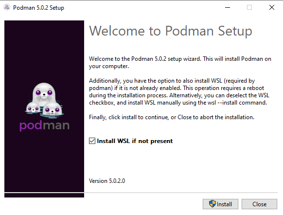
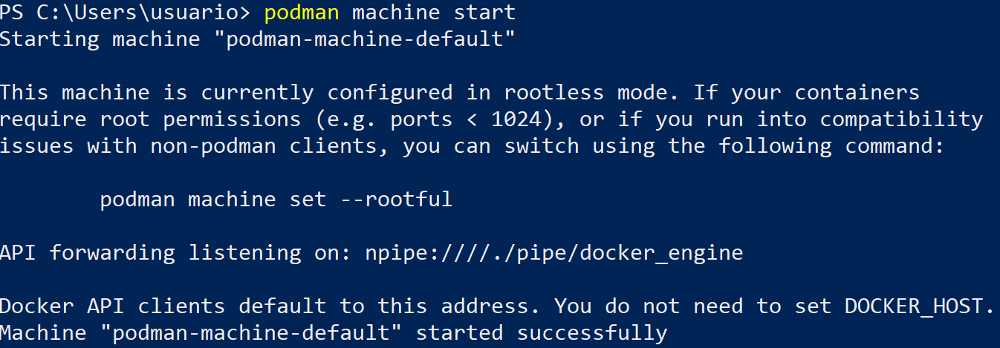

# Instalación de Podman en Windows/macOS

Para el sistema operativo macOS puedes encontrar información en la página oficial de [instalación de Podman](https://podman.io/docs/installation#macos).

En la [documentación oficial](https://github.com/containers/podman/blob/main/docs/tutorials/podman-for-windows.md) sobre la instalación de Podman en Windows puedes encontrar la información completa.

En ambos sistemas, Podman creará una máquina virtual Linux donde se ejecutará Podman y se accederá desde el cliente que lo tendremos instalado en el sistema anfitrión.

## Instalación en Windows

Los requisitos para realizar la instalación son los siguientes:

* La máquina virtual se crea en WSL (el subsistema Windows para Linux).
* Necesitamos una versión reciente de Windows 10 o Windows 11. Se requiere la compilación 18362 o superior.
* Su sistema debe soportar y tener habilitada la virtualización de hardware. 

1. Descargamos la última versión disponible del cliente de Podman desde la página de descargas [GitHub release page](https://github.com/containers/podman/releases). En este ejemplo trabajamos con la versión 5.0.2, el fichero `podman-5.0.2-setup.exe`.
2. Lo ejecutamos y realizamos la instalación.
   
    

3. Abrimos una terminal y comenzamos el proceso de creación de la máquina virtual:

    ```
    > podman machine init
    ```

    

4. Podemos ver las máquinas virtuales que hemos creado ejecutando:

    ```
    > podman machine list
    ```

    Iniciamos la máquina virtual:

    ```
    > podan machine start
    ```
    Por defecto la máquina virtual se ha iniciado para trabajar con contenedores rootless. Si queremos usar contenedores rootful, debemos ejecutar con la máquina parada:

    ```
    > podman machine set --rootful
    ```
    

5. Ya podemos utilizar Podman:

    

6. Podemos ejecutar otras operaciones sobre la máquina virtual. Si queremos acceder por ssh a la máquina virtual:

    ```
    > podman machine ssh
    ```

    Para parar la máquina virtual:

    ```
    > podman machine stop
    ```

    Para eliminar la máquina virtual:

    ```
    > podman machine rm
    ```
