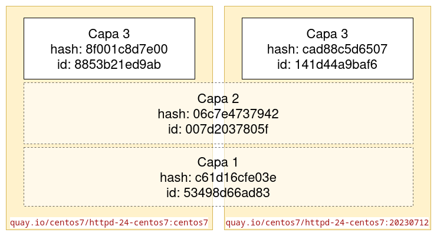

# Ahorro de espacio de almacenamiento

La estructura de almacenamiento que hemos explicado favorece el ahorro de espacio en disco ocupado por las imágenes. Si al descargar una imagen a nuestro registro local, esta formada por alguna capa que ya tenemos almacenada de otra imagen, esta capa no se descargará. Veamos un ejemplo:

Si a continuación bajamos otra versión de la misma imagen:

```
$ sudo podman pull quay.io/centos7/httpd-24-centos7:20230712
Trying to pull quay.io/centos7/httpd-24-centos7:20230712...
Getting image source signatures
Copying blob c61d16cfe03e skipped: already exists  
Copying blob 06c7e4737942 skipped: already exists  
Copying blob cad88c5d6507 done   | 
Copying config 6211883c1e done   | 
Writing manifest to image destination
6211883c1ed7ec96a12bbc9b214e70e5af406361db435905e85ba88b1483645b
```

Vemos cómo dos de las tres capas no se han descargados, porque son las mismas que teníamos ya descargadas. Si vemos el fichero de manifiesto donde se indican las capas de esta nueva imagen:

```
$ sudo cat overlay-images/6211883c1ed7ec96a12bbc9b214e70e5af406361db435905e85ba88b1483645b/manifest | jq
{
  "schemaVersion": 2,
  "mediaType": "application/vnd.docker.distribution.manifest.v2+json",
  "config": {
    "mediaType": "application/vnd.docker.container.image.v1+json",
    "size": 15279,
    "digest": "sha256:6211883c1ed7ec96a12bbc9b214e70e5af406361db435905e85ba88b1483645b"
  },
  "layers": [
    {
      "mediaType": "application/vnd.docker.image.rootfs.diff.tar.gzip",
      "size": 78951426,
      "digest": "sha256:c61d16cfe03e7bfb4e7e312f09fb17a815be72096544133320058ee6ce55d0b2"
    },
    {
      "mediaType": "application/vnd.docker.image.rootfs.diff.tar.gzip",
      "size": 10435798,
      "digest": "sha256:06c7e47379429b2a921140524d1596e2c2bf8bc7b29fa9df0ee73c91f5b4c24f"
    },
    {
      "mediaType": "application/vnd.docker.image.rootfs.diff.tar.gzip",
      "size": 50603263,
      "digest": "sha256:cad88c5d6507a80282a7942c790b0290aef5d302b790d988714de3535c7f8eb9"
    }
  ]
}
```
Vemos que las dos primeras capas coinciden con las de la imagen anterior y por tanto no se han descargado. De forma gráfica lo podríamos ver de la siguiente manera:



## Calcular el espacio que ocupan las imágenes

Tenemos una imagen llamada `quay.io/josedom24/servidorweb:latest` que está construida a partir de la imagen `docker.io/debian:stable-slim`. Por lo tanto la capa que forma está última imagen es compartida con la primera imagen.

Vamos a descargas las dos imágenes y comprobamos cuando ocupan realmente en disco:

```
$ podman pull docker.io/debian:stable-slim
Trying to pull docker.io/library/debian:stable-slim...
Getting image source signatures
Copying blob 8bd61dcf2ae5 done   | 
Copying config c3c8e6f4e5 done   | 
Writing manifest to image destination
c3c8e6f4e51e5b4fb4f159dc88b8251f3c83f932f7700cc048d08c0e6820b279

$ podman pull quay.io/josedom24/servidorweb:latest
Trying to pull quay.io/josedom24/servidorweb:latest...
Getting image source signatures
Copying blob ac25718b410c skipped: already exists  
Copying blob 82c502a57ff6 done   | 
Copying config 20dc5273de done   | 
Writing manifest to image destination
20dc5273de46e942048e158d148806432ae515d63c6e9dcbcb66a6a72dd8b347
```

Como hemos comentado la capa que forma parte de la imagen `docker.io/debian:stable-slim`, es la misma que una de las tres que forman la imagen `quay.io/josedom24/servidorweb:latest`.

Si visualizamos las imágenes:

```
$ podman images 
REPOSITORY                     TAG          IMAGE ID      CREATED         SIZE
quay.io/josedom24/servidorweb  latest       20dc5273de46  52 minutes ago  212 MB
docker.io/library/debian       stable-slim  c3c8e6f4e51e  30 hours ago    77.8 MB
```

Podemos pensar que se ha ocupado en el disco duro 212MB + 77.8MB, pero en realidad el tamaño de la capa que se comparte, sólo se guarda una vez en el disco duro. Podemos comprobarlo ejecutando el siguiente comando:

```
$ podman system df -v
Images space usage:

REPOSITORY                     TAG          IMAGE ID      CREATED     SIZE        SHARED SIZE  UNIQUE SIZE  CONTAINERS
docker.io/library/debian       stable-slim  c3c8e6f4e51e  30 hours    77.84MB     77.84MB      0B           0
quay.io/josedom24/servidorweb  latest       20dc5273de46  55 minutes  212MB       77.84MB      134.1MB      0

...
```
Vemos claramente que los 77.8 Mb que ocupa la capa compartida entre las dos imágenes aparece como tamaño compartido (`SHARED SIZED`).

Por lo tanto, ¿cuánto han ocupado en total estas dos imágenes en el disco duro? Pues sería 77.8MB + 124.1MB. El mecanismo de compartir capas entre imágenes hace que se ocupe el menor espacio posible en disco duro, el almacenamiento es muy eficiente.

