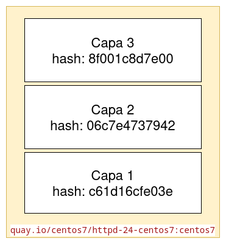
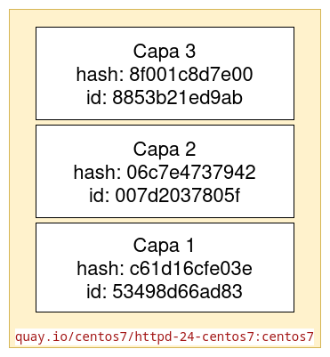

# Almacenamiento de imágenes

Podman puede usar varios drivers para gestionar el sistema de archivos de unión que constituye una imagen: overlay, vfs, devmapper, aufs, btrfs, zfs,...

El driver de almacenamiento que se usa por defecto para gestionar el conjunto de capas que forman parte de una imagen en la versión actual de Podman es **Overlay v2**. 

En el fichero de configuración de Podman donde se indica la configuración del almacenamiento, los parámetros más importantes son `graphDriverName`, donde se indica el driver utilizado y `graphroot` donde se indica el directorio de almacenamiento de las imágenes.

Dependiendo del modo de funcionamiento:

* **Modo rootful**. Fichero de configuración: `/usr/share/containers/storage.conf`.
  * `graphDriverName: overlay`
  * `graphRoot: /var/lib/containers/storage`
* **Modo rootless**. fichero de configuración: `$HOME/.config/containers/storage.conf`
  * `graphDriverName: overlay`
  * `graphRoot: /home/usuario/.local/share/containers/storage/`

## Ejemplo de almacenamiento imagen

Para ver este ejemplo, vamos a descargar una imagen para crear un contenedor rootful y veremos la estructura de los directorios donde se almacena. En primer lugar descargamos una imagen:

```
$ sudo podman pull quay.io/centos7/httpd-24-centos7:latest
Trying to pull quay.io/centos7/httpd-24-centos7:latest...
Getting image source signatures
Copying blob 8f001c8d7e00 done   | 
Copying blob c61d16cfe03e done   | 
Copying blob 06c7e4737942 done   | 
Copying config d7af31210b done   | 
Writing manifest to image destination
d7af31210b288164c319bae740ca1281528390a3c5cee657e95f243670b49e6a
```

Como observamos esta imagen está formado por 3 capas (`Copying blob...`) y su configuración (`Copying config...`).

Veamos la estructura de directorio que tenemos en el directorio de almacenamiento, como `root` ejecutamos las siguientes instrucciones:

```
$ cd /var/lib/containers/storage/
$ ls
db.sql  defaultNetworkBackend  libpod  overlay  overlay-containers  overlay-images  overlay-layers  secrets  storage.lock  tmp  userns.lock  volumes
```
Los directorios que nos interesan son los siguientes:

* `overlay-images`: Contiene la configuración (los metadatos) de las imágenes descargadas.
* `overlay-layers`: Contiene los archivos comprimidos de todas las capas de las imágenes que tenemos descargadas.
* `overlay`: Este es el directorio que contiene las capas descomprimidas de cada imagen.

### Directorio overlay-images

Veamos el directorio `overlay-images`:

```
$ cd overlay-images/
$ ls
d7af31210b288164c319bae740ca1281528390a3c5cee657e95f243670b49e6a  images.json  images.lock
```

Los ficheros y directorios que nos encontramos son los siguientes:

* `images.json`: Es un índice de las imágenes que tenemos descargadas. Para visualizarlo de manera correcta este fichero podemos usar la utilidad `jq`: `cat images.json | jq`.
* Distintos directorios que corresponde a las imágenes que tenemos descargadas en nuestro registro local. El nombre de estos directorios corresponden a los identificados de las imágenes. En estos directorios encontramos:
  * Un fichero de manifiesto llamado `manifest`, que describe las capas que componen la imagen.
  * Y distintos ficheros con las configuración de la imagen.

Podemos ver las capas que forman parte de la imagen que hemos descargado, ejecutando:

```
$ sudo cat overlay-images/d7af31210b288164c319bae740ca1281528390a3c5cee657e95f243670b49e6a/manifest | jq
{
  "schemaVersion": 2,
  "mediaType": "application/vnd.docker.distribution.manifest.v2+json",
  "config": {
    "mediaType": "application/vnd.docker.container.image.v1+json",
    "size": 15278,
    "digest": "sha256:d7af31210b288164c319bae740ca1281528390a3c5cee657e95f243670b49e6a"
  },
  "layers": [
    {
      "mediaType": "application/vnd.docker.image.rootfs.diff.tar.gzip",
      "size": 78951426,
      "digest": "sha256:c61d16cfe03e7bfb4e7e312f09fb17a815be72096544133320058ee6ce55d0b2"
    },
    {
      "mediaType": "application/vnd.docker.image.rootfs.diff.tar.gzip",
      "size": 10435798,
      "digest": "sha256:06c7e47379429b2a921140524d1596e2c2bf8bc7b29fa9df0ee73c91f5b4c24f"
    },
    {
      "mediaType": "application/vnd.docker.image.rootfs.diff.tar.gzip",
      "size": 50603928,
      "digest": "sha256:8f001c8d7e009adf9e088ff8b85806da558aa713eb545d2af045943eed1ad66a"
    }
  ]
}
```

Como vemos la imagen está formada por una configuración y por un conjunto de capas ordenadas, que están referenciada con un hash.

Podemos verlo de manera gráfica:




### Directorio overlay-layers

Veamos el directorio `overlay-layers`:

```
$ cd overlay-layers/
$ ls
007d2037805f6ca87f969f06c81286a47d98664e3f62e5fd393ec3da08a55b3c.tar-split.gz  layers.json
53498d66ad83a29fcd7c7bcf4abbcc0def4fc912772aa8a4483b51e232309aee.tar-split.gz  layers.lock
8853b21ed9ab4ab7fd6c118f5b1c11e974caa7e133a99981573434d3b6018cf0.tar-split.gz
```

Como hemos indicado, contiene los archivos comprimidos de todas las capas de las imágenes que tenemos descargadas. Además el fichero `layers.json` es un índice de todas las capas que tenemos descargadas:

```
$ sudo cat overlay-layers/layers.json | jq
[
    ...
    "id": "141d44a9baf68743b5ce89308008653d57296b999a10350ca42639b33cc7e8b5",
    "parent": "007d2037805f6ca87f969f06c81286a47d98664e3f62e5fd393ec3da08a55b3c",
    "created": "2024-03-22T13:04:22.383948168Z",
    "compressed-diff-digest": "sha256:cad88c5d6507a80282a7942c790b0290aef5d302b790d988714de3535c7f8eb9",
    "compressed-size": 50603263,
    "diff-digest": "sha256:5193cb56be73accb32574190c0638fb24e2386129be7dc436ba049ee400ec7a1",
    "diff-size": 110338048,
    "compression": 2,
    ...
```

Además del hash que vimos que identifica a la capa, encontramos también el campo `id` que es una cadena única que también nos permite referenciar a la capa. Además tenemos el campo `parent` donde encontramos el identificador de la capa superior (evidentemente la primera capa no tiene este parámetro).

De manera gráfica:



### Directorio overlay

Las capas que hemos visto anteriormente están descomprimidas en el directorio `overlay`:

```
$ cd overlay
$ ls
007d2037805f6ca87f969f06c81286a47d98664e3f62e5fd393ec3da08a55b3c  8853b21ed9ab4ab7fd6c118f5b1c11e974caa7e133a99981573434d3b6018cf0
53498d66ad83a29fcd7c7bcf4abbcc0def4fc912772aa8a4483b51e232309aee  l
```

En primer lugar tenemos un directorio por cada una de las capas descargadas. La estructura de estos directorios depende del orden de la capa, si vemos el contenido de una capa que no es la primera, tenemos la siguiente estructura:

```
$ cd 007d2037805f6ca87f969f06c81286a47d98664e3f62e5fd393ec3da08a55b3c/
$ ls
diff  link  lower  merged  work
```

Veamos que guardan cada uno de estos directorios y ficheros:

* `link`: Este archivo contiene un **identificador de capa abreviado**. Cada capa se identificará, además de por su hash y de su identificador con un nuevo identificados abreviado que corresponde a una cadena de texto más pequeño que el hash y el identificador. Posteriormente explicaremos porqué vamos a usar el identificador abreviado.
* `lower`: Este fichero contiene la lista de los identificados abreviados de las capas inferiores en orden. Es decir el fichero `lower` de la capa 3 contiene los identificados abreviados de la capa 2 y la capa 1. El de la capa 2 tendrá el identificador abreviador de la capa 1. Finalmente, la primera capa, no tendrá este fichero (ya que no tiene ninguna capa inferior) y si tendrá un directorio vacío llamado `empty`.
    ```
    $ sudo cat overlay/8853b21ed9ab4ab7fd6c118f5b1c11e974caa7e133a99981573434d3b6018cf0/lower
    l/IVBKXQVXCMS3S4MYZYTY4NQ3W5:l/LCIWXBIPSMIGB2RTQV36QKTCRH
    $ sudo cat overlay/007d2037805f6ca87f969f06c81286a47d98664e3f62e5fd393ec3da08a55b3c/lower
    l/LCIWXBIPSMIGB2RTQV36QKTCRH
    $ ls overlay/53498d66ad83a29fcd7c7bcf4abbcc0def4fc912772aa8a4483b51e232309aee/
    diff  empty  link  merged  work

* `diff`: Este directorio representa la capa superior de la superposición, y se utiliza para almacenar los cambios en la capa. Estos directorios serán los que unamos para crear un sistema de archivos de unión al crear un contenedor (pero ya veremos cómo se hace).
* `merged`: En este directorio se monta el sistema de fichero superpuesto.
* `work`: Este directorio está vacío y se utiliza para operaciones internas durante el montaje.

En el directorio `overlay` también encontramos un directorio `l`. En este directorio hay enlaces simbólicos, cuyos nombres son los identificadores de capa abreviados, que apuntan al directorio `diff` para cada capa. 

```
$ ls overlay/l
total 12
drwxr-xr-x. 1 root root 156 Mar 21 07:45 .
drwx------. 1 root root 422 Mar 21 07:45 ..
lrwxrwxrwx. 1 root root  72 Mar 21 07:38 IVBKXQVXCMS3S4MYZYTY4NQ3W5 -> ../007d2037805f6ca87f969f06c81286a47d98664e3f62e5fd393ec3da08a55b3c/diff
lrwxrwxrwx. 1 root root  72 Mar 21 07:38 LCIWXBIPSMIGB2RTQV36QKTCRH -> ../53498d66ad83a29fcd7c7bcf4abbcc0def4fc912772aa8a4483b51e232309aee/diff
lrwxrwxrwx. 1 root root  72 Mar 21 07:39 ZXSJGMR5T7VDVVGRWHG3E2I6DZ -> ../8853b21ed9ab4ab7fd6c118f5b1c11e974caa7e133a99981573434d3b6018cf0/diff
```

Nos podemos preguntar: ¿por qué usamos los identificados abreviados de capa y para qué sirven los enlaces simbólicos que encontramos en el directorio `l`?

En el próximo capítulo cuando creemos un nuevo contenedores se montará el sistema de archivos de unión que utilizará el contenedor. En este montaje habrá que indicar el conjunto de capas inferiores con el parámetro `lowerdir`. Sin embargo, no se usarán los nombres de los directorios directamente, por ejemplo no se usará el nombre:

```
var/lib/containers/storage/overlay/overlay/8853b21ed9ab4ab7fd6c118f5b1c11e974caa7e133a99981573434d3b6018cf0/diff
```

Si no que se usará el enlace simbólico correspondiente a dicha capa que se encuentra en el directorio `l`:

```
/var/lib/containers/storage/overlay/l/ZXSJGMR5T7VDVVGRWHG3E2I6DZ
```

El uso de enlaces simbólicos a la hora de montar un sistema de archivos de unión aporta mayor flexibilidad y eficiencia a la hora de trabajar con los ficheros de las diferentes capas.

De manera gráfica, tenemos el siguiente esquema:


## Ahorro de espacio de almacenamiento

La estructura de almacenamiento que hemos explicado favorece el ahorro de espacio en disco ocupado por las imágenes. Si al descargar una imagen a nuestro registro local, esta formada por alguna capa que ya tenemos almacenada de otra imagen, esta capa no se descargará. Veamos un ejemplo:

Si a continuación bajamos otra versión de la misma imagen:

```
$ sudo podman pull quay.io/centos7/httpd-24-centos7:20230712
Trying to pull quay.io/centos7/httpd-24-centos7:20230712...
Getting image source signatures
Copying blob c61d16cfe03e skipped: already exists  
Copying blob 06c7e4737942 skipped: already exists  
Copying blob cad88c5d6507 done   | 
Copying config 6211883c1e done   | 
Writing manifest to image destination
6211883c1ed7ec96a12bbc9b214e70e5af406361db435905e85ba88b1483645b
```

Vemos cómo dos de las tres capas no se han descargados, porque son las mismas que teníamos ya descargadas. Si vemos el fichero de manifiesto donde se indican las capas de esta nueva imagen:

```
$ sudo cat overlay-images/6211883c1ed7ec96a12bbc9b214e70e5af406361db435905e85ba88b1483645b/manifest | jq
{
  "schemaVersion": 2,
  "mediaType": "application/vnd.docker.distribution.manifest.v2+json",
  "config": {
    "mediaType": "application/vnd.docker.container.image.v1+json",
    "size": 15279,
    "digest": "sha256:6211883c1ed7ec96a12bbc9b214e70e5af406361db435905e85ba88b1483645b"
  },
  "layers": [
    {
      "mediaType": "application/vnd.docker.image.rootfs.diff.tar.gzip",
      "size": 78951426,
      "digest": "sha256:c61d16cfe03e7bfb4e7e312f09fb17a815be72096544133320058ee6ce55d0b2"
    },
    {
      "mediaType": "application/vnd.docker.image.rootfs.diff.tar.gzip",
      "size": 10435798,
      "digest": "sha256:06c7e47379429b2a921140524d1596e2c2bf8bc7b29fa9df0ee73c91f5b4c24f"
    },
    {
      "mediaType": "application/vnd.docker.image.rootfs.diff.tar.gzip",
      "size": 50603263,
      "digest": "sha256:cad88c5d6507a80282a7942c790b0290aef5d302b790d988714de3535c7f8eb9"
    }
  ]
}
```
Vemos que las dos primeras capas coinciden con las de la imagen anterior y por tanto no se han descargado. De forma gráfica lo podríamos ver de la siguiente manera:


## Calcular el espacio que ocupan las imágenes

Tenemos una imagen llamada `quay.io/josedom24/servidorweb:latest` que está construida a partir de la imagen `docker.io/debian:stable-slim`. Por lo tanto la capa que forma está última imagen es compartida con la primera imagen.

Vamos a descargas las dos imágenes y comprobamos cuando ocupan realmente en disco:

```
$ podman pull docker.io/debian:stable-slim
Trying to pull docker.io/library/debian:stable-slim...
Getting image source signatures
Copying blob 8bd61dcf2ae5 done   | 
Copying config c3c8e6f4e5 done   | 
Writing manifest to image destination
c3c8e6f4e51e5b4fb4f159dc88b8251f3c83f932f7700cc048d08c0e6820b279

$ podman pull quay.io/josedom24/servidorweb:latest
Trying to pull quay.io/josedom24/servidorweb:latest...
Getting image source signatures
Copying blob ac25718b410c skipped: already exists  
Copying blob 82c502a57ff6 done   | 
Copying config 20dc5273de done   | 
Writing manifest to image destination
20dc5273de46e942048e158d148806432ae515d63c6e9dcbcb66a6a72dd8b347
```

Como hemos comentado la capa que forma parte de la imagen `docker.io/debian:stable-slim`, es la misma que una de las tres que forman la imagen `quay.io/josedom24/servidorweb:latest`.

Si visualizamos las imágenes:

```
$ podman images 
REPOSITORY                     TAG          IMAGE ID      CREATED         SIZE
quay.io/josedom24/servidorweb  latest       20dc5273de46  52 minutes ago  212 MB
docker.io/library/debian       stable-slim  c3c8e6f4e51e  30 hours ago    77.8 MB
```

Podemos pensar que se ha ocupado en el disco duro 212MB + 77.8MB, pero en realidad el tamaño de la capa que se comparte, sólo se guarda una vez en el disco duro. Podemos comprobarlo ejecutando el siguiente comando:

```
$ podman system df -v
Images space usage:

REPOSITORY                     TAG          IMAGE ID      CREATED     SIZE        SHARED SIZE  UNIQUE SIZE  CONTAINERS
docker.io/library/debian       stable-slim  c3c8e6f4e51e  30 hours    77.84MB     77.84MB      0B           0
quay.io/josedom24/servidorweb  latest       20dc5273de46  55 minutes  212MB       77.84MB      134.1MB      0

...
```
Vemos claramente que los 77.8 Mb que ocupa la capa compartida entre las dos imágenes aparece como tamaño compartido (`SHARED SIZED`).

Por lo tanto, ¿cuánto han ocupado en total estas dos imágenes en el disco duro? Pues sería 77.8MB + 124.1MB. El mecanismo de compartir capas entre imágenes hace que se ocupe el menor espacio posible en disco duro, el almacenamiento es muy eficiente.

