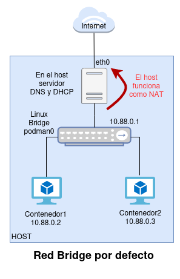
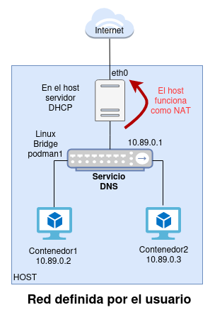

# Redes en Podman

Dependiendo del tipo de contenedor que creemos, Podman utilizará distintos mecanismos para ofrecer conectividad al contenedor:

* **Contenedores rootful**: Podman 4.0 utiliza un driver de red llamado [netavark](https://github.com/containers/netavark) para ofrecer a los contenedores una dirección IP enrutable. El driver netavark sigue las especificaciones establecidas por el proyecto [CNI](https://www.cni.dev/) (Container Network Interface) que estandariza los medios de comunicación de red que utilizan los contenedores OCI.
* **Contenedores rootless**: Cuando usamos contenedores rootless, tenemos una limitación debida a que los usuarios sin privilegios no pueden crear interfaces de red en el host. En este caso se utiliza, por defecto el proyecto [slirp4netns](https://github.com/rootless-containers/slirp4netns) que nos proporciona conectividad a los contenedores pero sin ofrecerles una dirección IP enrutable. En la nueva versión de Podman, la 5.0 este proyecto se ha sustituido por otro proyecto con las mismas características llamado [pasta](https://passt.top/passt/about/).

## Tipos de redes en Podman

* **Red Brige**: Es escenario más común cuando trabajamos con contenedores rootful. Nos permite que los contenedores estén conectados a una red privada, con un direccionamiento privado conectado al host mediante un Linux Bridge. 
    * Nos permiten aislar los contenedores del acceso exterior.
    * Los contenedores conectados a un red **bridge** tienen acceso a internet por medio de una regla SNAT. 
    * Usamos el parámetro `-p` en `podman run` para exponer algún puerto. Se crea una regla DNAT para tener acceso al puerto.
* **Redes macvlan o ipvlan**: Son configuraciones más avanzadas de red, donde se permite que el contenedor esté conectado directamente a la red donde está conectado el host. La diferencia entre las dos, es que mientras macvlan permite la comunicación entre contenedores, ipvlan aisla completamente a cada contenedor.
* **Red slirp4netns**: Es una configuración de red con capacidades limitadas pero puede ser utilizada con los contenedores rootless. Crea un túnel desde el host al contenedor para reenviar el tráfico.

## Redes bridge

Existen dos tipos de redes bridge:

* La red **bridge** creada por defecto por Podman para que de forma predeterminada los contenedores tengan conectividad.
* Y las **redes bridge definidas por el usuario**.

### Red bridge por defecto

* Es creada durante la instalación de Podman.
    ```
    $ sudo podman network ls
    NETWORK ID    NAME        DRIVER
    2f259bab93aa  podman      bridge
    ```
* Por defecto los contenedores que creamos se conectan a la red de tipo bridge llamada **podman**.
* Se crea en el host un *Linux Bridge* llamado **podman0**.
* El direccionamiento de esta red es 10.88.0.0/16.
* Por compatibilidad con las red por defecto que crea Docker, esta red no tiene un servidor DNS activo.



### Red bridge definida por el usuario

* Nos permiten aislar los distintos contenedores que tengo en distintas redes privadas, de tal manera que desde cada una de las redes solo podamos acceder a los equipos de esa misma red.
* Nos proporcionan **resolución DNS** entre los contenedores, por lo que los contenedores puedan conectar a otros contenedores usando su nombre.
* Me permiten **gestionar de manera más segura el aislamiento de los contenedores**, ya que si no indico una red al arrancar un contenedor éste se incluye en la red por defecto donde pueden convivir servicios que no tengan nada que ver.
* Nos proporcionan **más control sobre la configuración de las redes**. Los contenedores de la red por defecto comparten todos la misma configuración de red (MTU, reglas de cortafuegos, etc...).
* Es importante que nuestros contenedores en producción se ejecuten conectados a una red bridge definida por el usuario.



## Red slirp4netns

* Es el mecanismo de red usado en los contenedores rootless, ya que los usuarios sin privilegios no pueden crear interfaces de red en el host.
* Crea un entorno de red aislado para el contenedor y utilizando el módulo `slirp` del kernel para realizar la traducción de direcciones de red (NAT), lo que permite que el contenedor acceda a internet a través de la conexión de red del host.
* Crea un dispositivo TAP en el espacio de nombres de red del contenedor y se conecta a la pila TCP/IP en modo usuario. 
* Al utilizar este tipo de red, el usuario sin privilegio tendrá que usar puertos no privilegiados, mayores que el 1024.
* Uno de los inconvenientes de slirp4netns es que los contenedores están completamente aislados unos de otros, por lo que tendrán que utilizar los puertos expuestos para comunicarse.

