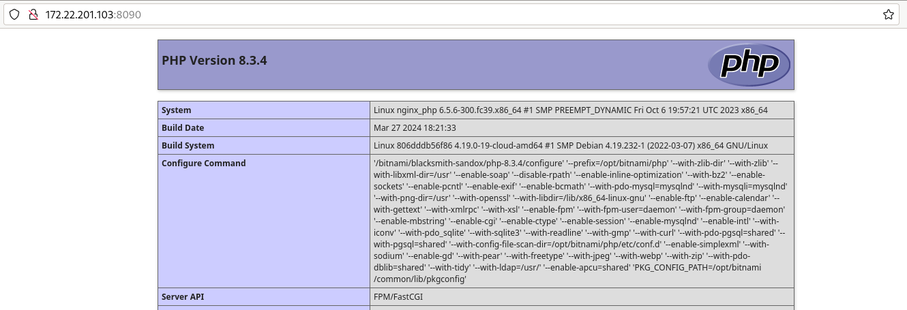

# Ejemplo: nginx + fpm-php

En esta apartado, vamos a crear un Pod que tendrán dos contenedores: 

* Un servidor web nginx configurado de para servir contenido PHP.
* El código PHP será interpretado  por un servidor de aplicación fpm-php que se ejecutará en el otro contenedor. 

En este ejemplo hay que tener en cuenta varios aspectos:

* Vamos a usar imágenes ofrecidas por la empresa Bitnami, estás imágenes tienen como características que los procesos que se ejecutan al crear el contenedor son ejecutados por usuarios no privilegiados. Es decir, vamos a trabajar con contenedores rootless cuyos procesos son ejecutados por usuarios sin privilegios.
* Para que nginx y fpm-php funcionen de forma adecuada, ambos deben poder acceder al contenido de la aplicación, es decir deben tener almacenamiento compartido.
* Recordemos que ambos contenedores se van comunicar mediante la dirección 127.0.0.1.

Puedes encontrar los ficheros necesarios en el directorio `modulo5/nginx/web` del [Repositorio con el código de los ejemplos](https://github.com/josedom24/ejemplos_curso_podman_ow).

En el directorio `web` tendremos un fichero `index.php` que mostrará información del PHP que se está utilizando.

En ese directorio tendremos también la configuración del servidor nginx para servir contenido PHP usando un servidor de aplicaciones fpm-php. Este fichero se montará en la creación del contenedor, tal cómo se nos explica en la documentación de la imagen [`docker.io/bitnami/nginx`](https://hub.docker.com/r/bitnami/nginx). El contenido del fichero `server_block.conf` será:

```
server {
  listen 0.0.0.0:8080;
  server_name myapp.com;

  root /app;

  location / {
    try_files $uri $uri/index.php;
  }

  location ~ \.php$ {
    fastcgi_pass 127.0.0.1:9000;
    fastcgi_index index.php;
    include fastcgi.conf;
  }
}
```
Hay que tener en cuenta:

* Se crea un servidor web que utiliza el puerto 8080/tcp. Esta imagen utilizan un usuario sin privilegios por lo que no puede servir la aplicación usando el puerto 80/tcp.
* nginx conectará con el servidor de aplicación fpm-php en el puerto 9000/tcp de `localhost`(127.0.0.1) como hemos indicado anteriormente.

A continuación, creamos nuestro Pod, que realizará el mapeo de puerto y declarará el almacenamiento compartido para que los dos contenedores tengan acceso al código de la aplicación:

```
podman pod create --name nginx_php -v ${PWD}/web:/app:z -p 8090:8080
```

Añadimos los dos contenedores, teniendo en cuenta montar el fichero de configuración de nginx cómo se explica en la documentación de la imagen:

```
podman run --pod nginx_php --name nginx -d -v ${PWD}/web/server_block.conf:/opt/bitnami/nginx/conf/server_blocks/yourapp.conf:Z docker.io/bitnami/nginx
podman run --pod nginx_php --name fpm_php -d docker.io/bitnami/php-fpm
```

Comprobamos el Pod y los contenedores que hemos creado:

```
podman pod ps
POD ID        NAME        STATUS      CREATED        INFRA ID      # OF CONTAINERS
56dafee5d502  nginx_php   Running     5 minutes ago  d43308bffcf8  3

$ podman ps --pod
CONTAINER ID  IMAGE                                    COMMAND               CREATED        STATUS        PORTS                   NAMES               POD ID        PODNAME
d43308bffcf8  localhost/podman-pause:4.9.4-1711445992                        5 minutes ago  Up 5 minutes  0.0.0.0:8090->8080/tcp  56dafee5d502-infra  56dafee5d502  nginx_php
5e33c6af13d1  docker.io/bitnami/php-fpm:latest         php-fpm -F --pid ...  5 minutes ago  Up 5 minutes  0.0.0.0:8090->8080/tcp  fpm_php             56dafee5d502  nginx_php
5af6eab919d2  docker.io/bitnami/nginx:latest           /opt/bitnami/scri...  3 minutes ago  Up 3 minutes  0.0.0.0:8090->8080/tcp  nginx               56dafee5d502  nginx_php
```

Finalmente, podemos acceder a la dirección IP del host y el puerto que hemos mapeado y comprobamos que el código PHP se está sirviendo de manera adecuada:



