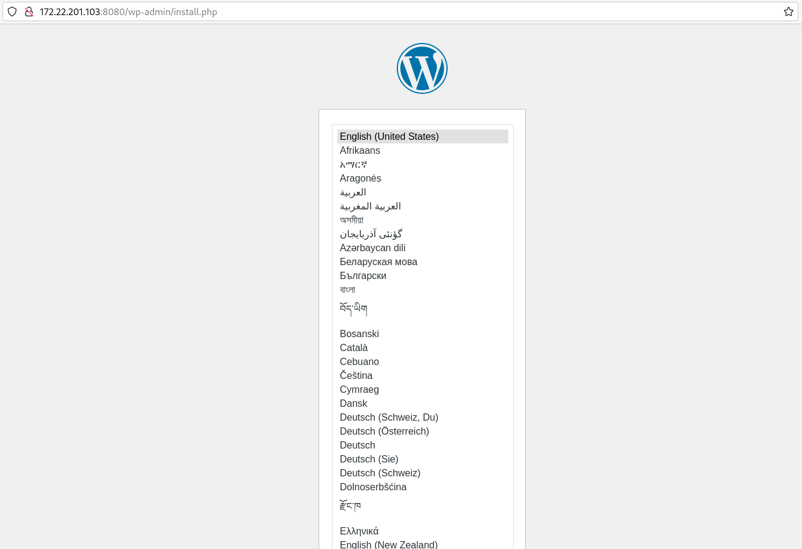

# Ejemplo: Despliegue de WordPress + MariaDB en un escenario multipod

En el ejemplo anterior hemos desplegado WordPress y MariaDB en dos contenedores dentro de un Pod. Con esa solución Podman nos ofrece la posibilidad de trabajar con escenarios multicontenedor agrupando los contenedores dentro de un Pod.

Sin embargo, en muchos escenarios es preferible que cada servicio se ejecute en un Pod diferenciado, esto nos permite gestionar cada servicio por separado y facilita las labores de actualización o escalado de cada servicio por separado.

En este ejemplo, vamos a volver a desplegar WordPress + MariaDB con las siguientes características:
* Utilizaremos Pod diferenciados para cada contenedor que ofrece el servicio. 
* Será necesario utilizar una red definida por el usuario, ya que necesitamos resolución DNS a nivel de Pod para que un contenedor de un Pod se pueda conectar al otro contenedor del otro Pod usando su nombre del Pod. 
* Tendremos que publicar el cada Pod el puerto que utiliza cada servicio que sirve.
* En la configuración del contenedor de la aplicación web (varibale de entorno `WORDPRESS_DB_HOST`) se indicará el nombre del Pod de la base de datos para acceder al servicio.
* Utilizaremos volúmenes para hacer persistente la aplicación.

Creamos la red definida por el usuario:

```
$ sudo podman network create red_wp
```

A continuación vamos a crear los dos Pods:

```
$ sudo podman pod create --name mariadb-pod -p 3306:3306 --network red_wp
$ sudo podman pod create --name wordpress-pod -p 8080:80 --network red_wp
```

A continuación añadimos el contenedor a cada Pod:

```
$ sudo podman run --pod mariadb-pod -d --name db \
                -v dbvol:/var/lib/mysql \
                -e MARIADB_DATABASE=wordpress \
                -e MARIADB_USER=wordpress \
                -e MARIADB_PASSWORD=wordpress \
                -e MARIADB_ROOT_PASSWORD=myrootpasswd \
                docker.io/mariadb

$ sudo podman  run --pod wordpress-pod -d --name wordpress \
                -v wpvol:/var/www/html \
                -e WORDPRESS_DB_HOST=mariadb-pod \
                -e WORDPRESS_DB_USER=wordpress \
                -e WORDPRESS_DB_PASSWORD=wordpress \
                -e WORDPRESS_DB_NAME=wordpress \
                docker.io/wordpress
```

Vemos los Pods y contenedores que hemos creado:

```
$ sudo podman pod ps --ctr-names
POD ID        NAME               STATUS      CREATED        INFRA ID      NAMES
4539e047ef62  mariadb-pod        Running     2 minutes ago  7ee82573c019  4539e047ef62-infra,db
9646085b179e  wordpress-pod      Running     8 minutes ago  4274fc776781  9646085b179e-infra,wordpress

$ sudo podman ps --pod
CONTAINER ID  IMAGE                                    COMMAND               CREATED             STATUS             PORTS                   NAMES               POD ID        PODNAME
4274fc776781  localhost/podman-pause:4.9.4-1711445992                        9 minutes ago       Up 6 minutes       0.0.0.0:8080->80/tcp    9646085b179e-infra  9646085b179e  wordpress-pod
7ee82573c019  localhost/podman-pause:4.9.4-1711445992                        2 minutes ago       Up About a minute  0.0.0.0:3306->3306/tcp  4539e047ef62-infra  4539e047ef62  mariadb-pod
2d10f3953300  docker.io/library/mariadb:latest         mariadbd              About a minute ago  Up About a minute  0.0.0.0:3306->3306/tcp  db                  4539e047ef62  mariadb-pod
9a9dee02cb0a  docker.io/library/wordpress:latest       apache2-foregroun...  38 seconds ago      Up 38 seconds      0.0.0.0:8080->80/tcp    wordpress           9646085b179e  wordpress-pod
``` 

Y comprobamos que podemos acceder a la aplicación:


