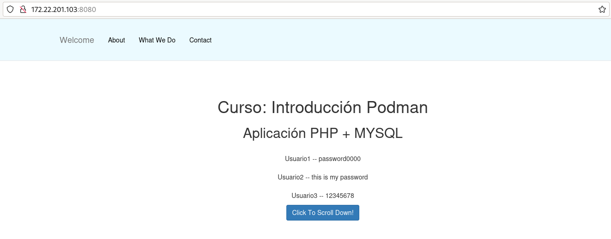

# Construcción de imágenes configurables con variables de entorno

En este ejemplo vamos a desplegar una aplicación PHP que accede a una base de datos. Por lo tanto vamos a generar dos imágenes: una para servir la aplicación PHP y otra para servir nuestra base de datos.

Puedes encontrar los ficheros que vamos a utilizar en el directorio `modulo8/php` del [Repositorio con el código de los ejemplos](https://github.com/josedom24/ejemplos_curso_podman_ow).

Hay que tener en cuenta los siguientes aspectos:

* Vamos a crear una imagen con una base de datos MariaDB inicializada con una base de datos.
* Vamos a crear dos versiones de la imagen de la aplicación PHP:
  * Versión 1: Desde una imagen base.
  * Versión 2: Desde una imagen con PHP instalado.

## Imagen MariaDB

En la [documentación](https://hub.docker.com/_/mariadb) de la imagen `mariadb` nos informa que para inicializar la base de datos al crear un contenedor podemos copiar un fichero con extensión `sql` con las instrucciones SQL para la creación de las tablas de la base de datos en el directorio `/docker-entrypoint-initdb.d`.

Por lo tanto en el directorio `mariadb` encontramos el fichero `Containerfile` para crear una nueva imagen, y el fichero `schema.sql` con las instrucciones SQL para la creación de la base de datos.

el fichero `Containerfile` tendrá este contenido:

```
FROM docker.io/mariadb:10.5
COPY schema.sql /docker-entrypoint-initdb.d/
```

Para crear la nueva imagen ejecutamos:

```
$ podman build -t josedom24/mibd:latest .
```

Cuando creemos un contenedor a partir de esta imagen se inicializará la base de datos con las instrucción del fichero `schema.sql` que crea una tabla `users` e introduce algunos registros en la misma.

## Imagen aplicación PHP

Cuando programamos una aplicación tenemos que tener en cuenta que va a ser implantada usando contenedores y puede que tengamos que hacer algunas modificaciones, por ejemplo en este caso, las credenciales para el acceso a la base de datos la leemos de variables de entorno (que posteriormente serán creadas en el contenedor):

```
<?php
 // Database host
 $host = getenv('DB_HOST');
 // Database user name
 $user = getenv('DB_USER');
 //Database user password
 $pass = getenv('DB_PASS');
 //Database name
 $db = getenv('DB_NAME');
 // check the MySQL connection status
 $conn = new mysqli($host, $user, $pass,$db);
 if ($conn->connect_error) {
     die("Connection failed: " . $conn->connect_error);
 } else {
     $sql = 'SELECT * FROM users';
     
     if ($result = $conn->query($sql)) {
         while ($data = $result->fetch_object()) {
             $users[] = $data;
         }
     }
     
     foreach ($users as $user) {
        echo "<br>";
        echo $user->username . " " . $user->password;
        echo "<br>";
    }
 }
 mysqli_close($conn);
 ?>
```

Como hemos indicado vamos a crear dos versiones de esta imagen:

### Versión 1: Desde una imagen base

En el contexto vamos a tener el fichero `Conteinarfile` y un directorio, llamado `app`, con nuestra aplicación.

En este caso vamos a usar una imagen base de un sistema operativo base. El fichero `Conteinarfile` será el siguiente:

```
FROM debian:12
RUN apt-get update && apt-get install -y apache2 libapache2-mod-php php php-mysql && apt-get clean && rm -rf /var/lib/apt/lists/*
RUN rm /var/www/html/index.html
COPY app /var/www/html/
EXPOSE 80
ENV DB_USER user1
ENV DB_PASS asdasd
ENV DB_NAME usuarios
ENV DB_HOST mariadb
VOLUME /var/log/apache2
CMD apache2ctl -D FOREGROUND
```

* Al usar una imagen base `debian:12` tenemos que instalar los paquetes necesarios para tener el servidor web, PHP y las librerías necesarias. 
* Hemos borrado el fichero `/var/www/html/index.html` para que no sea el fichero que se muestre por defecto.
* A continuación añadiremos el contenido del directorio `app` al directorio `/var/www/html/` del contenedor. 
* Finalmente indicamos el comando que se deberá ejecutar al crear un contenedor a partir de esta imagen: iniciamos el servidor web en segundo plano.
* cuando creemos un contenedor a partir de esta imagen se creará un volumen anónimo que se montará en el directorio `/var/log/apache2`.

Para crear la imagen ejecutamos:

```
$ podman build -t josedom24/aplicacion_php .
```     

Comprobamos que la imagen se ha creado:

```
$ podman images
REPOSITORY                             TAG               IMAGE ID      CREATED        SIZE
localhost/josedom24/aplicacion_php     latest            338c62a398cf  6 seconds ago  225 MB
```

Y podemos crear el escenario utilizando el fichero `compose.yaml`:

```
version: '3.1'
services:
  app:
    container_name: servidor_php
    image: josedom24/aplicacion_php
    restart: always
    environment:
      DB_HOST: servidor_mariadb
      DB_USER: user1
      DB_PASS: asdasd
      DB_NAME: usuarios
    ports:
      - 8080:80
    depends_on:
      - db
  db:
    container_name: servidor_mariadb
    image: josedom24/mibd
    restart: always
    environment:
      MARIADB_DATABASE: usuarios
      MARIADB_USER: user1
      MARIADB_PASSWORD: asdasd
      MARIADB_ROOT_PASSWORD: asdasd
    volumes:
      - mariadb_data:/var/lib/mysql
volumes:
    mariadb_data:
```

Y creo el escenario:

```
$ podman-compose up -d
```
Podemos comprobar los volúmenes que se han creado:

```
$ podman volume ls
DRIVER      VOLUME NAME
local       php_mariadb_data
local       927dbae27b74585c31fa80369d4a8ed2b35fe08209878205f32bfdbf0badf957
```

Y acceder con el navegador a nuestra página:



La aplicación tiene un fichero `info.php` que me da información sobre PHP, en este caso observamos que estamos usando la versión 8.2:


Finalmente elimino los contenedores, sin eliminar los volúmenes:

```
$ podman-compose down
```

### Versión 2: Desde una imagen con PHP instalado

En este caso el fichero `Conteinarfile` sería el siguiente:

```
FROM docker.io/php:7.4-apache
RUN docker-php-ext-install mysqli && docker-php-ext-enable mysqli
COPY app /var/www/html/
EXPOSE 80
ENV DB_USER user1
ENV DB_PASS asdasd
ENV DB_NAME usuarios
ENV DB_HOST mariadb
VOLUME /var/log/apache2
```

* Creamos la imagen desde una imagen PHP, que ofrece un servidor web Apache con el módulo PHP.
* Siguiendo la documentación de la [imagen oficial de PHP](https://hub.docker.com/_/php) instalamos el módulo PHP `mysqli`.
* Copiamos la aplicación en el servidor web.
* Creamos las variables de entorno y le damos valores por defecto, por si no se indican en la creación del contenedor.
* Al igual que en la versión anterior se creará un volumen anónimo para guardar los logs del servidor web.
* No hace falta indicar el CMD porque se ejecutará el de la imagen base.

De forma similar, crearíamos una imagen y un contenedor:

```
$ podman build -t josedom24/aplicacion_php .
$ podman-compose up -d
```
Hemos utilizado el mismo nombre con la etiqueta `latest` para no cambiar el fichero `compose.yaml`. Ahora podríamos acceder a la aplicación y comprobar que sigue funcionando, además podríamos acceder al fichero `info.php` para comprobar la versión de PHP que estamos utilizando.